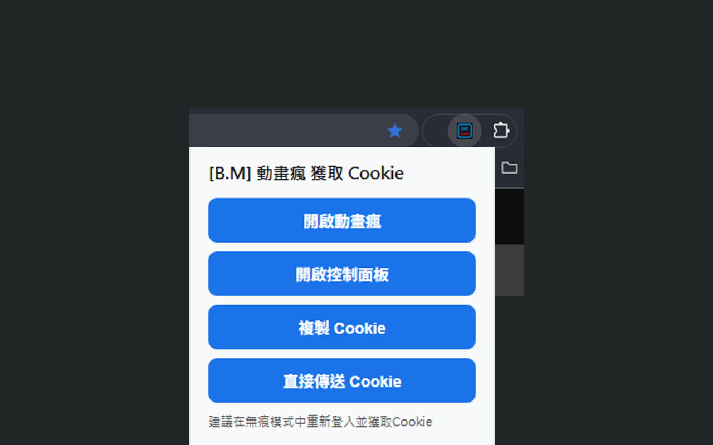

# [B.M] 動畫瘋 獲取 Cookie

[](https://developer.chrome.com/docs/extensions/mv3/)
[](https://ani.gamer.com.tw)
[](https://github.com/BoringMan314/bm-ani-gamer-get-cookie)
[](https://github.com/BoringMan314/bm-ani-gamer-get-cookie/releases)
[](LICENSE)

適用於 [巴哈姆特動畫瘋](https://ani.gamer.com.tw)（`ani.gamer.com.tw`）的瀏覽器擴充功能：提供 Cookie 字串，供貼上至 aniGamerPlus 等程式之 cookie.txt 使用。建議使用無痕視窗登入並勾選保持登入。

*适用于巴哈姆特动画疯（ani.gamer.com.tw）的浏览器扩展功能：提供 Cookie 字符串，供粘贴到 aniGamerPlus 等程序的 cookie.txt 使用。建议使用无痕窗口登录并勾选保持登录。*<br>
*動畫瘋（ani.gamer.com.tw）向けのブラウザ拡張機能：Cookie 文字列を提供します。aniGamerPlus などの cookie.txt に貼り付けてご利用ください。シークレットウィンドウでログインし、「ログイン状態を保持」にチェックすることをおすすめします。*<br>
*Browser extension for Bahamut Anime Crazy (ani.gamer.com.tw): provides a Cookie string for pasting into cookie.txt used by aniGamerPlus and similar apps. Prefer signing in from an Incognito window with “stay signed in.”*

> **聲明**：本專案為第三方輔助工具，與動畫瘋／巴哈姆特官方無關。Cookie 具登入敏感性，請勿外流。使用請遵守該站服務條款與著作權規範。

---



---

## 目錄

- [功能](#功能)
- [系統需求](#系統需求)
- [安裝方式](#安裝方式)
- [本機開發與測試](#本機開發與測試)
- [技術概要](#技術概要)
- [專案結構](#專案結構)
- [版本與多語系](#版本與多語系)
- [隱私說明](#隱私說明)
- [維護者：更新 GitHub 與 Chrome 線上應用程式商店](#維護者更新-github-與-chrome-線上應用程式商店)
- [授權](#授權)
- [問題與建議](#問題與建議)

---

## 功能

- 僅讀取 **動畫瘋**（`https://ani.gamer.com.tw`，含對 **`api.gamer.com.tw`** 之 partitioned Cookie）情境下之一組 Cookie，與 DevTools 於動畫瘋頁請求 API 所見對齊。
- 略過 **`ckBH_lastBoard`**（方便對齊 aniGamerPlus 慣例）。
- 若目前視窗的焦點分頁為 **`ani.gamer.com.tw`**，優先使用該分頁所屬 **Cookie store**（例如無痕與一般視窗分流）。
- **Manifest V3**，介面為 [`popup`](popup.html)；僅宣告 **`cookies`** 與 **`https://ani.gamer.com.tw/*`、`https://api.gamer.com.tw/*`** 之 host 權限（不含論壇／首頁等其他 gamer 子站）。
- 建議在 **無痕視窗** 登入動畫瘋並勾選 **保持登入**，取得獨立、可汰換的 Cookie；複製前讓 **動畫瘋分頁為目前視窗作用中分頁**，可降低選錯 Cookie 集合的機率。

---

## 系統需求

- **Chrome** 或 **Microsoft Edge**（Chromium）等支援 **Manifest V3** 的瀏覽器。

---

## 安裝方式

### 從 Chrome 線上應用程式商店（建議）

請在 [Chrome Web Store](https://chromewebstore.google.com/) 搜尋 **「[B.M] 動畫瘋 獲取 Cookie」**，或點擊名稱從商店頁面安裝。

### 從原始碼載入（開發人員模式）

1. 點選本頁綠色 **Code** → **Download ZIP** 解壓，或執行 `git clone https://github.com/BoringMan314/bm-ani-gamer-get-cookie.git` 複製本倉庫。
2. 以 **Chrome** 或 **Microsoft Edge** 開啟 `chrome://extensions`（在 Edge 為 `edge://extensions`）。
3. 開啟「**開發人員模式**」→「**載入未封裝項目**」→ 選取含 [`manifest.json`](manifest.json) 的**專案根目錄**（勿選子資料夾）。
4. 點工具列圖示開啟 popup，於動畫瘋登入後再試「複製 Cookie」。

---

## 本機開發與測試

修改 [`popup.js`](popup.js)、[`popup.css`](popup.css) 或 [`popup.html`](popup.html) 後，在 `chrome://extensions` 將本擴充**重新載入**，再開啟 popup 或重新整理動畫瘋分頁驗證。

---

## 技術概要

- [`popup.js`](popup.js)：使用 `chrome.cookies.getAll` / `getAllCookieStores`，僅讀取 **`topLevelSite: https://ani.gamer.com.tw`** 之 partitioned Cookie（`ani`／`api` 網址篩選）；將結果寫入剪貼簿。
- 不向任何遠端網址送出 Cookie（無背景 `fetch` 上傳）。

---

## 專案結構

| 路徑 | 說明 |
|------|------|
| [`manifest.json`](manifest.json) | Manifest V3、權限與 popup |
| [`popup.html`](popup.html) / [`popup.css`](popup.css) / [`popup.js`](popup.js) | Popup 介面與邏輯 |
| [`_locales/`](_locales/) | 多語系（`zh_TW`、`zh_CN`、`ja_JP`、`en_US`） |
| [`privacy-policy.html`](privacy-policy.html) | 隱私權政策（上架商店所需之公開網頁） |
| [`icons/`](icons/) | 工具列與商店用圖示：icon.png |
| [`screenshot/`](screenshot/) | 商店與說明用截圖 |

---

## 版本與多語系

- **版本**：以 [`manifest.json`](manifest.json) 的 `version` 為準。
- **預設語系**：`zh_TW`（`default_locale`）。
- **內建語系**：`zh_TW`、`zh_CN`、`ja_JP`、`en_US`（路徑為 `_locales/<code>/messages.json`）。實際顯示依瀏覽器語系與遞減規則。

---

## 隱私說明

本擴充**不蒐集、不上傳** Cookie 至開發者伺服器；僅在您按下按鈕時於本機讀取並寫入剪貼簿。**未內建**遠端可執行程式、分析或廣告追蹤。詳見 [`privacy-policy.html`](privacy-policy.html)。

**上架提醒**：若上架 Chrome Web Store，須在開發人員後台完成隱私實踐聲明，並提供本政策之**公開 HTTPS 網址**（建議以 [GitHub Pages](https://pages.github.com/) 託管專案內的 `privacy-policy.html`）。

---

## 維護者：更新 GitHub 與 Chrome 線上應用程式商店

### 更新至 GitHub

**Bash / Git Bash / PowerShell：**

```powershell
git add .
git commit -m "docs: 更新內容說明與商店連結"
git push origin main
```

### 更新至 Chrome 線上應用程式商店

請透過 [Chrome Web Store 開發人員控制台](https://chrome.google.com/webstore/devconsole) 手動上傳更新：

1. **遞增版本**：若要發布商店更新，請將 [`manifest.json`](manifest.json) 中的 `version` 調高於商店已上架版本。
2. **封裝套件**：將專案內容壓縮為 ZIP 檔。
   - **必要檔案**：`manifest.json`, `popup.html`, `popup.js`, `popup.css`, `privacy-policy.html`, `icons/`, `_locales/`
   - **建議不打包**：`.git/`, `.gitignore`, `README.md`, `screenshot/`, `*.psd`, `*.zip`, `*.url`
3. **上傳審核**：在控制台選擇項目 →「套件」→「上傳新套件」。
4. **提交送審**：確認版號、商店文案、截圖、隱私欄位與 `privacy-policy` 公開網址無誤後，點擊「**提交送審**」。

---

## 授權

本專案以 [MIT License](LICENSE) 授權。

---

## 問題與建議

歡迎透過 [GitHub Issues](https://github.com/BoringMan314/bm-ani-gamer-get-cookie/issues) 回報錯誤或提出改善建議。回報時請一併提供瀏覽器版本、**介面語言**及重現步驟；若與 Cookie 讀取有關，請註明是否無痕、是否在動畫瘋前景分頁。
